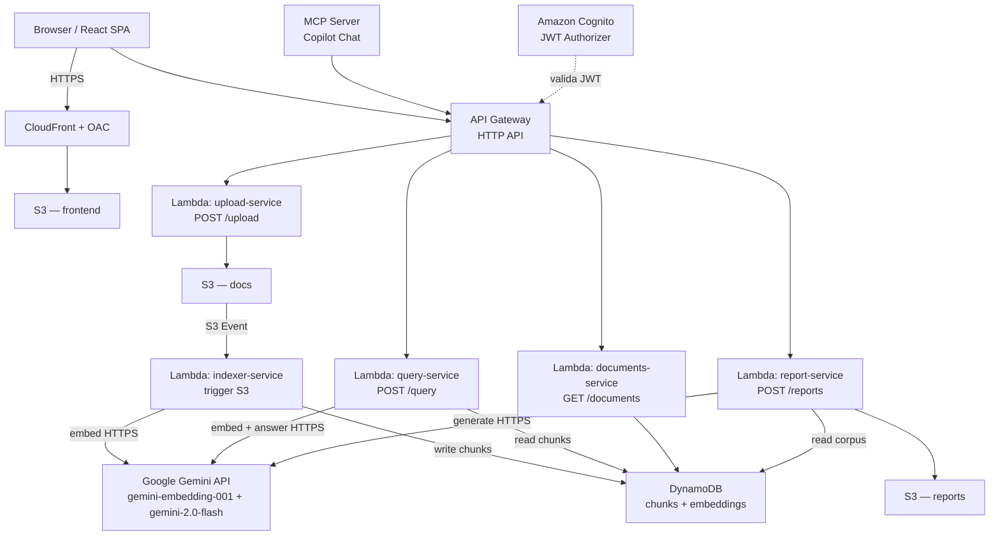

# SemanticSearch — RAG sobre documentos propios

Sistema de búsqueda semántica (RAG): el usuario sube documentos (PDF/Word), el sistema
los chunkea + embedea + indexa, y permite hacer preguntas en lenguaje natural que se
responden citando las fuentes exactas de los documentos.

**Proyecto académico (Proyecto F)** — requisito explícito: aplicar cómputo en la nube
con **serverless y/o microservicios**. Ver [`TODO.md`](TODO.md) para el plan de fases,
[`docs/architecture.md`](docs/architecture.md) para el diagrama y decisiones de
arquitectura completos, y [`docs/blueprint-csharp.md`](docs/blueprint-csharp.md)
para el código de referencia de cada servicio.

## Stack

- **Backend:** C# / .NET 8, funciones AWS Lambda independientes (sin ASP.NET Core
  monolítico — cada Lambda es un microservicio con una sola responsabilidad)
- **API:** API Gateway (HTTP API) enrutando a cada Lambda
- **Storage de documentos:** S3
- **Vector store:** DynamoDB + similitud coseno calculada en memoria dentro del Lambda
  (no hay vector DB gestionada gratis en AWS — ver razonamiento abajo)
- **Embeddings + LLM:** Google Gemini API (`gemini-embedding-001` / `text-embedding-004`
  para embeddings + `gemini-2.0-flash` o `2.5-flash` para respuestas y reportes),
  llamada por HTTP directo desde cada Lambda — no AWS Bedrock (ver razonamiento abajo)
- **Auth:** Amazon Cognito (JWT Authorizer nativo de API Gateway)
- **Frontend:** React (Vite + TypeScript), servido como SPA estática desde S3 + CloudFront
- **IaC:** AWS SAM (`infra/template.yaml`)
- **CI/CD:** GitHub Actions con OIDC hacia AWS (sin access keys estáticas)

## Arquitectura



## Por qué esta arquitectura (decisiones no obvias)

- **Migrado de Azure a AWS** porque el requisito de la materia exige AWS. **El crédito
  promocional inicial ya se agotó** — la cuenta ya no tiene margen de $0 garantizado.
  Ahora solo cuentan como gratis los servicios **Always Free** permanentes (Lambda,
  DynamoDB, Cognito, CloudWatch hasta 5GB de ingesta, CloudFront hasta 1TB/10M
  requests, Step Functions), que siguen siendo $0 sin importar la antigüedad de la
  cuenta. **API Gateway y S3 ya no son gratis** — se facturan desde el primer request/byte
  (S3 ~$0.023/GB/mes + costo por request; API Gateway HTTP API ~$1 por millón de
  requests). A la escala de un proyecto académico esto sigue siendo centavos, pero ya
  no es "$0 automático": cada decisión de diseño que reduzca requests/Scans/tokens
  ahora se traduce directo en factura real, no solo en riesgo futuro.
- **DynamoDB en vez de un vector store gestionado:** OpenSearch (Service o Serverless)
  no tiene free tier real y puede costar $700+/mes si no se administra con cuidado.
  RDS+pgvector tiene free tier pero solo 12 meses (ya no aplica) y rompe el modelo
  serverless (instancia siempre prendida). Por eso: chunks + embeddings en DynamoDB
  (Always Free hasta 25GB / 25 RCU-WCU, permanente), y la búsqueda de similitud se hace
  en código dentro del Lambda. Ojo: un `Scan` completo en cada query/reporte consume
  RCU reales una vez superado ese umbral — conviene cachear el índice de embeddings
  (S3 o memoria del Lambda) en vez de golpear DynamoDB en cada request.
- **Google Gemini API en vez de Amazon Bedrock para embeddings + LLM** — Bedrock no
  tiene ningún free tier (pay-per-token desde la primera llamada). Se compraron $25 USD
  de créditos de la API de Gemini (**tier de pago**, no la API key gratuita de AI
  Studio) — esto da además la garantía contractual de Google de que el contenido no se
  usa para entrenar sus modelos, algo que la app necesita al tratarse de una base de
  conocimiento privada de documentos de empresa. A los precios de `gemini-2.0-flash`
  (~$0.10/1M tokens entrada, ~$0.40/1M salida) y de los modelos de embedding, $25 cubre
  holgadamente el volumen de un proyecto académico.
  - Los Lambdas llaman la API de Gemini por HTTPS directo (sin SDK de AWS) — deben
    **permanecer fuera de una VPC** para tener salida a internet gratis; meterlos en
    VPC exigiría un NAT Gateway (~$32/mes fijos), lo que anularía el ahorro.
  - La API key de Gemini se guarda en SSM Parameter Store (SecureString), igual que
    cualquier otro secreto del proyecto.
  - Embeddings: `gemini-embedding-001` (truncado vía MRL a 768 dims) o
    `text-embedding-004` (768 dims fijas) — con `task_type=RETRIEVAL_DOCUMENT` al
    indexar chunks y `task_type=RETRIEVAL_QUERY` al embeddear la pregunta del usuario.
  - Sigue conviniendo cachear embeddings/respuestas repetidas y usar map-reduce en
    `report-service` en vez de meter el corpus completo en un solo prompt — reduce el
    consumo de créditos aunque ya no dependa del free tier de Bedrock. Hay un AWS
    Budget Alert configurado para el resto de la infraestructura (S3, API Gateway).
- **Lambdas separados por responsabilidad (no un solo Lambda con ASP.NET Core)** — es
  la forma de cumplir el requisito de "microservicios" de la materia: cada función escala,
  se despliega y se factura de forma independiente.
- **.NET 8 (no .NET 10)** para las Lambdas — es el runtime managed más reciente que AWS
  Lambda soporta nativamente al momento de escribir esto. Si se necesitan features de
  .NET 10, la alternativa es empaquetar la Lambda como imagen de contenedor, pero por
  defecto se prioriza el runtime nativo (cold start más rápido, menos complejidad).

## Estructura del repo

```
src/
  SemanticSearch.Core/                # modelos y contratos compartidos
  SemanticSearch.Functions.Upload/    # Lambda: POST /upload
  SemanticSearch.Functions.Indexer/   # Lambda: trigger S3 → chunk → embed → DynamoDB
  SemanticSearch.Functions.Query/     # Lambda: POST /query (embed → search → answer)
  SemanticSearch.Functions.Documents/ # Lambda: GET /documents, /reindex, /health
  SemanticSearch.McpServer/           # servidor MCP (tools: search/list/reindex)
frontend/                             # React SPA (Vite + TS)
infra/                                # AWS SAM template
tests/
docs/                                 # blueprint, conceptos de C#/.NET, setup dev/prod
```

> Nota: a la fecha de este archivo, la migración de Azure a AWS está en progreso —
> revisar `TODO.md` para ver qué fases ya están implementadas vs. planificadas.
> El código bajo `src/SemanticSearch.Api/` y `infra/*.bicep` corresponden a la versión
> anterior sobre Azure y quedan como referencia hasta completar la migración.

## Convenciones de código

- Interfaces explícitas (`IServicio` + `Servicio`) para todo lo inyectable — facilita
  mockear en tests.
- Primary constructors (C# 12) para inyección de dependencias en clases de servicio.
- `record` para DTOs/requests/responses (inmutables).
- Sin contenedor IoC de ASP.NET Core en las Lambdas — la inyección de dependencias se
  arma a mano en el constructor del handler (no hay `Program.cs` con `builder.Services`).

## Seguridad — reglas duras del proyecto

- Nunca commitear credenciales, access keys ni connection strings.
- Desarrollo local: `dotnet user-secrets`. Producción: Secrets Manager / SSM Parameter
  Store — nunca variables de entorno en texto plano para secretos.
- CI/CD usa OIDC hacia AWS (rol IAM asumible), no access keys estáticas en GitHub Secrets.
- Permisos IAM mínimos por Lambda (least privilege).
- Buckets S3 sin acceso público directo; el frontend se sirve vía CloudFront con OAC.

## Comandos frecuentes

```bash
# Build y test de toda la solución
dotnet build
dotnet test

# Build y deploy de infraestructura (SAM)
sam build
sam deploy --guided

# Frontend
cd frontend
npm run dev
npm run build
```

Ver [`docs/setup-dev-prod.md`](docs/setup-dev-prod.md) para el setup completo de
credenciales y entornos local/producción,
[`docs/local-development.md`](docs/local-development.md) para la referencia
completa del CLI de AWS/SAM CLI y el entorno local (Docker Compose), con los
comandos exactos y los problemas reales encontrados al levantarlo,
[`docs/terraform-setup.md`](docs/terraform-setup.md) para el flujo de Terraform y el
setup de CI/CD, y [`docs/contributing.md`](docs/contributing.md) para cómo se hacen
los PRs en este repo (`main` protegida, `gh` CLI, qué dispara `ci.yml`/`deploy.yml`).
