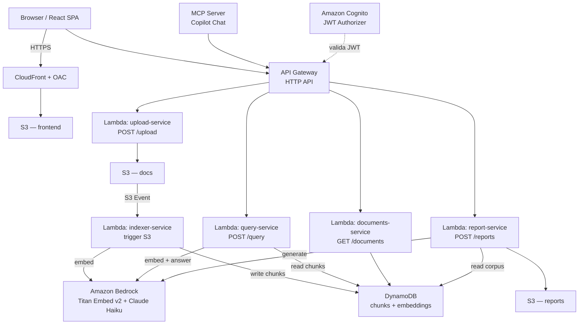

# SemanticSearch — RAG sobre documentos propios

Sistema de búsqueda semántica (RAG): el usuario sube documentos (PDF/Word), el sistema
los chunkea + embedea + indexa, y permite hacer preguntas en lenguaje natural que se
responden citando las fuentes exactas de los documentos.

**Proyecto académico (Proyecto F)** — requisito explícito: aplicar cómputo en la nube
con **serverless y/o microservicios**. Ver [`TODO.md`](TODO.md) para el plan de fases,
[`docs/architecture.md`](docs/architecture.md) para el diagrama y decisiones de
arquitectura completos, y [`docs/blueprint-csharp.md`](docs/blueprint-csharp.md)
para el código de referencia de cada servicio.

## Stack

- **Backend:** C# / .NET 8, funciones AWS Lambda independientes (sin ASP.NET Core
  monolítico — cada Lambda es un microservicio con una sola responsabilidad)
- **API:** API Gateway (HTTP API) enrutando a cada Lambda
- **Storage de documentos:** S3
- **Vector store:** DynamoDB + similitud coseno calculada en memoria dentro del Lambda
  (no hay vector DB gestionada gratis en AWS — ver razonamiento abajo)
- **Embeddings + LLM:** Amazon Bedrock (Titan Embed Text v2 + Claude Haiku)
- **Auth:** Amazon Cognito (JWT Authorizer nativo de API Gateway)
- **Frontend:** React (Vite + TypeScript), servido como SPA estática desde S3 + CloudFront
- **IaC:** AWS SAM (`infra/template.yaml`)
- **CI/CD:** GitHub Actions con OIDC hacia AWS (sin access keys estáticas)

## Arquitectura



## Por qué esta arquitectura (decisiones no obvias)

- **Migrado de Azure a AWS** porque el requisito de la materia exige AWS. La cuenta es
  **nueva (2026)**, por lo que el free tier clásico de "12 meses gratis" **no aplica**:
  en su lugar hay $100-200 de crédito por 6 meses + un set de servicios **Always Free**
  permanentes (Lambda, DynamoDB, Cognito, CloudWatch, Step Functions, CloudFront).
  El diseño se apoya deliberadamente en los servicios Always Free para que el costo de
  infraestructura sea $0 incluso después de agotar el crédito inicial.
- **DynamoDB en vez de un vector store gestionado:** OpenSearch (Service o Serverless)
  no tiene free tier real y puede costar $700+/mes si no se administra con cuidado.
  RDS+pgvector tiene free tier pero solo 12 meses y rompe el modelo serverless (instancia
  siempre prendida). Por eso: chunks + embeddings en DynamoDB (Always Free, 25GB), y la
  búsqueda de similitud se hace en código dentro del Lambda. Funciona bien para un corpus
  de documentos de tamaño académico; no es la elección correcta para producción a gran
  escala.
- **Bedrock es el único costo real** — no tiene free tier, es pay-per-token. El volumen
  de pruebas de un proyecto de clase cuesta centavos. Hay un AWS Budget Alert configurado
  para evitar gastos accidentales.
- **Lambdas separados por responsabilidad (no un solo Lambda con ASP.NET Core)** — es
  la forma de cumplir el requisito de "microservicios" de la materia: cada función escala,
  se despliega y se factura de forma independiente.
- **.NET 8 (no .NET 10)** para las Lambdas — es el runtime managed más reciente que AWS
  Lambda soporta nativamente al momento de escribir esto. Si se necesitan features de
  .NET 10, la alternativa es empaquetar la Lambda como imagen de contenedor, pero por
  defecto se prioriza el runtime nativo (cold start más rápido, menos complejidad).

## Estructura del repo

```
src/
  SemanticSearch.Core/                # modelos y contratos compartidos
  SemanticSearch.Functions.Upload/    # Lambda: POST /upload
  SemanticSearch.Functions.Indexer/   # Lambda: trigger S3 → chunk → embed → DynamoDB
  SemanticSearch.Functions.Query/     # Lambda: POST /query (embed → search → answer)
  SemanticSearch.Functions.Documents/ # Lambda: GET /documents, /reindex, /health
  SemanticSearch.McpServer/           # servidor MCP (tools: search/list/reindex)
frontend/                             # React SPA (Vite + TS)
infra/                                # AWS SAM template
tests/
docs/                                 # blueprint, conceptos de C#/.NET, setup dev/prod
```

> Nota: a la fecha de este archivo, la migración de Azure a AWS está en progreso —
> revisar `TODO.md` para ver qué fases ya están implementadas vs. planificadas.
> El código bajo `src/SemanticSearch.Api/` y `infra/*.bicep` corresponden a la versión
> anterior sobre Azure y quedan como referencia hasta completar la migración.

## Convenciones de código

- Interfaces explícitas (`IServicio` + `Servicio`) para todo lo inyectable — facilita
  mockear en tests.
- Primary constructors (C# 12) para inyección de dependencias en clases de servicio.
- `record` para DTOs/requests/responses (inmutables).
- Sin contenedor IoC de ASP.NET Core en las Lambdas — la inyección de dependencias se
  arma a mano en el constructor del handler (no hay `Program.cs` con `builder.Services`).

## Seguridad — reglas duras del proyecto

- Nunca commitear credenciales, access keys ni connection strings.
- Desarrollo local: `dotnet user-secrets`. Producción: Secrets Manager / SSM Parameter
  Store — nunca variables de entorno en texto plano para secretos.
- CI/CD usa OIDC hacia AWS (rol IAM asumible), no access keys estáticas en GitHub Secrets.
- Permisos IAM mínimos por Lambda (least privilege).
- Buckets S3 sin acceso público directo; el frontend se sirve vía CloudFront con OAC.

## Comandos frecuentes

```bash
# Build y test de toda la solución
dotnet build
dotnet test

# Build y deploy de infraestructura (SAM)
sam build
sam deploy --guided

# Frontend
cd frontend
npm run dev
npm run build
```

Ver [`docs/setup-dev-prod.md`](docs/setup-dev-prod.md) para el setup completo de
credenciales y entornos local/producción.
