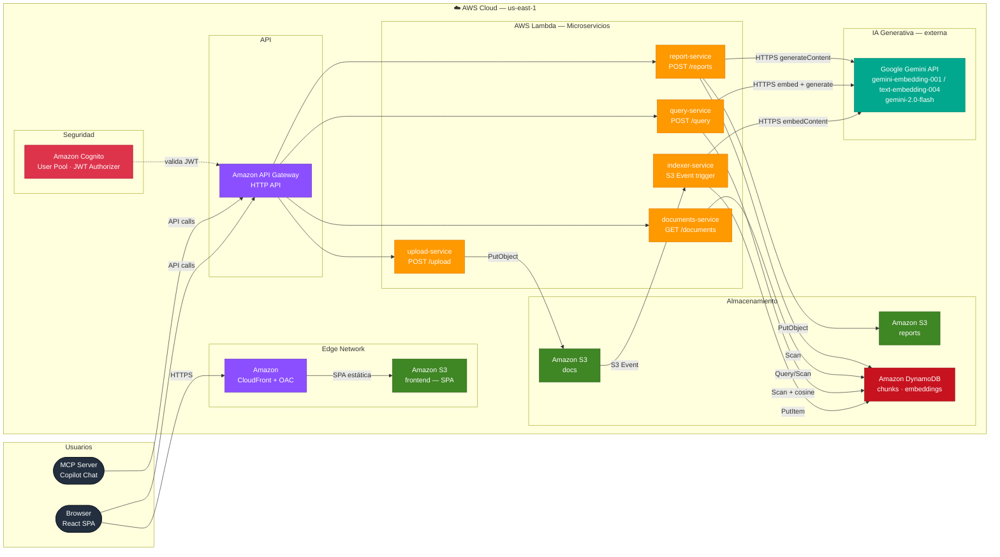
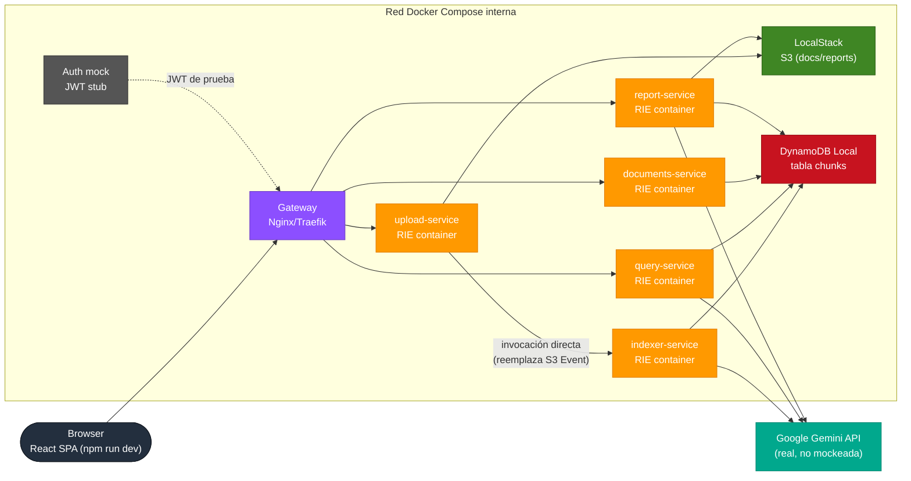

# Arquitectura — SemanticSearch RAG

Sistema de búsqueda semántica sobre documentos propios. El usuario sube PDFs/Word,
el sistema los chunkea, genera embeddings y los indexa; las preguntas en lenguaje
natural se responden citando fuentes exactas de los documentos.

**Stack:** C# / .NET 8 · AWS Lambda · API Gateway (HTTP API) · DynamoDB ·
Google Gemini API · S3 · Amazon Cognito · CloudFront · Terraform · GitHub Actions (OIDC) · React (Vite + TS)

---

## Diagrama general



---

## Pipelines

### Pipeline A — Ingesta de documentos

```
Cliente ──POST /upload──► API Gateway ──► Lambda (upload-service)
                                                    │
                                                    ▼
                                           S3 (bucket docs)
                                                    │
                                       S3 Event Notification
                                                    ▼
                                       Lambda (indexer-service)
                                                    │
                          ┌─────────────────────────┤
                          ▼                         ▼
                  Google Gemini API           DynamoDB
              (embedContent, batch)        (tabla "chunks")
```

1. El cliente hace `POST /upload` con el archivo (PDF / DOCX / TXT)
2. `upload-service` valida tamaño y tipo, sube el objeto al bucket S3 `docs`
3. S3 dispara un evento `s3:ObjectCreated:*` que invoca `indexer-service`
4. `indexer-service` extrae el texto, lo divide en chunks con sliding window (512 palabras, overlap 64), llama a la API de Gemini (`batchEmbedContents`, `task_type=RETRIEVAL_DOCUMENT`) para generar el embedding de cada chunk, y escribe los `ChunkRecord` en DynamoDB
5. Si falla, el objeto se mueve al prefijo `failed/` en S3 (en vez de DLQ gestionada, para mantenerse en Always Free)

### Pipeline B — Query RAG

```
Cliente ──POST /query──► API Gateway ──► Lambda (query-service)
                                                    │
                                           embed query text
                                                    ▼
                                          Google Gemini API
                                    (embedContent, RETRIEVAL_QUERY)
                                                    │
                                     similitud coseno en memoria
                                                    ▼
                                               DynamoDB
                                             (top-K chunks)
                                                    │
                                           build RAG prompt
                                                    ▼
                                          Google Gemini API
                                          (gemini-2.0-flash)
                                                    │
Cliente ◄── { answer, sources } ───────────────────┘
```

1. El cliente envía la pregunta en lenguaje natural
2. `query-service` genera el embedding de la pregunta con Gemini (`task_type=RETRIEVAL_QUERY`)
3. Lee todos los chunks de DynamoDB y calcula similitud coseno en memoria, retorna top-K
4. Arma un prompt RAG con los fragmentos más relevantes y llama a `gemini-2.0-flash`
5. Devuelve la respuesta con fuentes citadas (`documentId`, `filename`, `page`, `score`)

### Pipeline C — Generación de informes

```
Cliente ──POST /reports──► API Gateway ──► Lambda (report-service)
                                                    │
                                        lee corpus completo
                                                    ▼
                                               DynamoDB
                                                    │
                                         genera con Gemini
                                                    ▼
                                          Google Gemini API
                                          (gemini-2.0-flash)
                                                    │
                                           guarda el informe
                                                    ▼
                                           S3 (bucket reports)
                                                    │
Cliente ◄── { reportId, downloadUrl } ─────────────┘
```

El informe se genera según un escenario predefinido (`summary`, `risks`, `compare`,
`extract`, `custom`) y queda disponible en S3 con URL prefirmada durante 7 días.

---

## Servicios AWS y decisiones de diseño

### Cuenta AWS y costos

> **Actualización:** el crédito promocional inicial ya se agotó. La cuenta ya no tiene
> un colchón de $0 garantizado — ahora se factura con las tarifas normales de AWS desde
> el primer uso. Lo que sigue siendo gratis es solo el tier **Always Free**, que es
> permanente independientemente de la antigüedad de la cuenta:

| Servicio | Nivel gratis | ¿Sigue siendo $0? |
|---|---|---|
| Lambda | 1M requests + 400,000 GB-s/mes | Sí, Always Free permanente |
| DynamoDB | 25GB + 25 RCU/WCU | Sí, Always Free permanente |
| Cognito | 50,000 MAU | Sí, Always Free permanente |
| CloudFront | 1TB salida + 10M requests/mes | Sí, Always Free permanente |
| CloudWatch Logs | 5GB de ingesta/mes | Sí, pero sin retención configurada crece sin límite — hay que fijar `retention_in_days` |
| **S3** | 5GB + requests | **No** — ya se factura desde el primer byte/request (~$0.023/GB/mes) |
| **API Gateway (HTTP API)** | 1M requests (solo primeros 12 meses) | **No** — ya se factura desde el primer request (~$1/millón) |
| **Google Gemini API** | N/A (no es AWS) | Pay-per-token con **$25 USD de créditos comprados** (tier de pago, no la API key gratuita de AI Studio) |

A la escala de un proyecto académico (decenas/cientos de documentos, tráfico de
pruebas) el total sigue siendo de centavos a pocos dólares al mes, pero ya no es
automático — cada optimización de código (evitar `Scan`s completos de DynamoDB en
cada query/reporte, cachear embeddings repetidos, limitar tokens enviados a Gemini
en `report-service`) ahora se traduce en factura real y no solo en riesgo futuro. Hay
un AWS Budget Alert configurado para el gasto en AWS — conviene revisar el umbral
ahora que no hay crédito de respaldo — y monitorear por separado el consumo de
créditos de Gemini en Google AI Studio / Cloud Console.

### Por qué Google Gemini API y no Amazon Bedrock

Amazon Bedrock no tiene ningún nivel gratis — cada llamada se factura desde el primer
uso. La API de Gemini, en cambio, se está usando en **tier de pago** con $25 USD de
créditos ya comprados, lo que además da la garantía contractual de Google de que el
contenido enviado no se usa para entrenar sus modelos (relevante porque la app es una
base de conocimiento privada de documentos de empresa — el tier gratuito de AI Studio
no da esa garantía).

- **Modelos:** `gemini-embedding-001` (truncado vía MRL a 768 dims) o
  `text-embedding-004` (768 dims fijas) para embeddings; `gemini-2.0-flash` /
  `2.5-flash` para las respuestas RAG y los reportes.
- **`task_type`:** Gemini permite indicar el propósito del embedding —
  `RETRIEVAL_DOCUMENT` al indexar chunks, `RETRIEVAL_QUERY` al embeddear la pregunta
  del usuario — mejora la calidad del retrieval sin costo extra (Titan no lo ofrecía).
- **Batching:** `batchEmbedContents` permite embeddear varios chunks de un documento en
  una sola llamada HTTP, reduciendo latencia y número de requests en `indexer-service`.
- **Networking:** los Lambdas llaman la API de Gemini por HTTPS directo desde fuera de
  una VPC (Lambda sin VPC tiene salida a internet gratis). **No meter estos Lambdas en
  una VPC** — exigiría un NAT Gateway (~$32/mes fijos) que anularía el ahorro de usar
  Gemini en primer lugar.
- **Secretos:** la API key de Gemini se guarda en SSM Parameter Store (SecureString),
  igual que cualquier otro secreto del proyecto — nunca en variable de entorno plana.

### Por qué DynamoDB y no un vector store gestionado

| Opción | Problema |
|---|---|
| OpenSearch Service / Serverless | Sin free tier real; puede costar $700+/mes por los OCUs mínimos |
| RDS + pgvector | Free tier solo 12 meses; instancia siempre prendida — rompe el modelo serverless |
| **DynamoDB** | Always Free (25 GB); chunks + embeddings en items; similitud coseno calculada en código dentro del Lambda |

Para un corpus académico (decenas/cientos de documentos), un `Scan` + similitud
coseno en memoria es rápido y simple. No es la elección correcta para millones de
chunks en producción.

### Por qué Lambdas separados por responsabilidad

En vez de un monolito Lambda con ASP.NET Core sirviendo todos los endpoints, cada
operación es su propia función: `upload`, `indexer`, `query`, `documents`, `reports`.
Esto cumple el requisito de "microservicios" de la materia: cada función escala,
se despliega y se factura de forma independiente, con un único motivo para cambiar.

### Por qué .NET 8 y no .NET 10

.NET 8 es el runtime managed más reciente que AWS Lambda soporta nativamente. Si se
necesitan features de .NET 10, la alternativa es empaquetar la Lambda como imagen de
contenedor, pero se prioriza el runtime nativo (cold start más rápido, menos
complejidad).

---

## DynamoDB — diseño de la tabla `chunks`

| Atributo | Tipo | Rol |
|---|---|---|
| `documentId` | String | Partition Key |
| `chunkId` | String | Sort Key |
| `text` | String | texto del chunk |
| `embedding` | List\<Number\> | vector de embedding (Gemini `text-embedding-004` / `gemini-embedding-001` truncado vía MRL = 768 dims) |
| `filename` | String | nombre original del documento |
| `page` | Number | página de origen (si aplica) |
| `status` | String | `indexed` / `failed` |
| `createdAt` | String (ISO 8601) | fecha de indexado |

La tabla `documents` (metadata) guarda el registro por documento: `documentId`,
`filename`, `status`, `chunkCount`, `uploadedAt`. Se implementa como ítems con
`chunkId = "META"` dentro de la misma tabla o en una tabla separada.

---

## Endpoints de la API

| Método | Path | Auth | Lambda | Descripción |
|---|---|---|---|---|
| POST | `/upload` | JWT (Cognito) | `upload-service` | Sube documento a S3, dispara indexación |
| POST | `/query` | JWT (Cognito) | `query-service` | Búsqueda semántica RAG |
| GET | `/documents` | JWT (Cognito) | `documents-service` | Lista documentos con estado y metadata |
| POST | `/reindex/{docId}` | JWT (Cognito) | `documents-service` | Fuerza re-indexación de un documento |
| DELETE | `/documents/{docId}` | JWT (Cognito) | `documents-service` | Elimina documento y sus chunks |
| GET | `/health` | ninguna | `documents-service` | Health check (excluido del JWT Authorizer) |
| POST | `/reports` | JWT (Cognito) | `report-service` | Inicia generación de informe |
| GET | `/reports/{reportId}` | JWT (Cognito) | `report-service` | Descarga el informe generado |

---

## Infraestructura como código (Terraform)

> IaC migrado de Bicep (Azure) y AWS SAM a **Terraform**. Los archivos `*.bicep`
> y `infra/template.yaml` quedan como referencia histórica.

```
infra/
├── main.tf          # recursos principales (Lambdas, API GW, S3, DynamoDB, Cognito)
├── variables.tf     # variables de entorno y región
├── outputs.tf       # URL de API Gateway, distribución CloudFront, ARNs
├── backend.tf       # backend remoto S3 + locking DynamoDB para el estado
└── terraform.tfvars.example  # plantilla (el .tfvars real no se commitea)
```

Comandos de despliegue:

```bash
terraform init
terraform plan -out=tfplan
terraform apply tfplan
```

Permisos IAM mínimos por Lambda (least privilege — ninguna función tiene `*` en
resources). La distribución CloudFront usa Origin Access Control (OAC) para servir
el bucket frontend sin exponerlo públicamente.

---

## Entorno local (Docker Compose) — desarrollo sin AWS

Mientras se espera la aprobación para desplegar en la cuenta de AWS, toda la topología
de microservicios + red interna se puede levantar localmente con Docker Compose, usando
el **mismo código de Lambda** que después se despliega (sin reescribir a ASP.NET Core)
y llamando a la **API real de Gemini** — la IA no se mockea, es lo que se está probando.



| Pieza AWS | Equivalente local | Nota |
|---|---|---|
| Lambda | Contenedor por función, imagen `public.ecr.aws/lambda/dotnet:8` + Runtime Interface Emulator (RIE) | Mismo handler que se despliega a AWS, cero reescritura |
| API Gateway | Contenedor gateway (Nginx/Traefik) enrutando por path hacia el RIE de cada función | Simula el ruteo, no la facturación ni el JWT Authorizer nativo |
| S3 | LocalStack (Community, gratis) | Mismo `IAmazonS3`, solo cambia el endpoint |
| DynamoDB | DynamoDB Local (`amazon/dynamodb-local`) o LocalStack | Mismo `IAmazonDynamoDB`, compatibilidad de API 1:1 |
| Cognito | JWT stub (contenedor ligero que emite un token de prueba fijo) | Cognito real no se emula bien en local; para desarrollo basta un JWT válido |
| Red interna / VPC | Red Docker Compose dedicada (`bridge`) | Simula la segmentación de red sin costo |
| Bedrock/Gemini | **Real** — llamada directa a la API de Gemini desde los contenedores | La IA nunca se mockea |

**Diferencia conocida vs. producción:** el trigger de S3 (`s3:ObjectCreated:*` →
`indexer-service`) es asíncrono, y LocalStack Community no lo encadena de forma
confiable a Lambda sin la versión Pro. En local, `upload-service` invoca directamente
el endpoint HTTP de `indexer-service` después del `PutObject` — documentado aquí como
una simplificación deliberada, no como paridad total con AWS.

Con esto se puede desarrollar y demostrar la separación de microservicios, el ruteo
tipo API Gateway y la red interna — el requisito de la materia — sin tocar la cuenta
de AWS ni esperar la aprobación.

---

## CI/CD — GitHub Actions (OIDC)

```
.github/workflows/
├── deploy.yml           # build · test · terraform apply (backend + Lambdas)
└── deploy-frontend.yml  # npm build · sync S3 · invalidación CloudFront
```

El rol IAM `AWS_DEPLOY_ROLE_ARN` se configura con confianza hacia el OIDC provider
de GitHub Actions — nunca se guardan access keys de AWS en GitHub Secrets.

```yaml
- name: Configure AWS credentials (OIDC)
  uses: aws-actions/configure-aws-credentials@v4
  with:
    role-to-assume: ${{ vars.AWS_DEPLOY_ROLE_ARN }}
    aws-region: us-east-1
```

---

## Frontend — React SPA (Vite + TypeScript)

```
frontend/
├── src/
│   ├── api/client.ts         # fetch wrapper con URL de API Gateway + JWT
│   ├── pages/
│   │   ├── UploadPage.tsx    # drag & drop → upload-service
│   │   ├── DocumentsPage.tsx # lista + estado de indexado → documents-service
│   │   ├── QueryPage.tsx     # chat de preguntas → query-service, muestra fuentes
│   │   └── ReportsPage.tsx   # selector de escenario → report-service
│   └── App.tsx
└── vite.config.ts
```

Build de producción (`npm run build`) → sync del directorio `dist/` al bucket S3
`frontend` (privado) → invalidación de la distribución CloudFront que sirve la SPA
con OAC.

---

## Servidor MCP — agente @doc-search

Expone tres herramientas a Copilot Chat sin cambios en el código; solo cambia la URL
del entorno a la URL de API Gateway en AWS.

```json
// .vscode/settings.json
{
  "github.copilot.chat.mcpServers": {
    "doc-search": {
      "command": "dotnet",
      "args": ["run", "--project", "src/SemanticSearch.McpServer"],
      "env": {
        "API_URL": "https://xxxxxxxxxx.execute-api.us-east-1.amazonaws.com"
      }
    }
  }
}
```

| Herramienta | Descripción |
|---|---|
| `search_documents` | Búsqueda semántica RAG sobre el corpus |
| `list_documents` | Lista documentos indexados y su estado |
| `reindex_document` | Fuerza la re-indexación de un documento por ID |

---

Ver [`TODO.md`](../TODO.md) para el estado de implementación por fases y
[`docs/blueprint-csharp.md`](blueprint-csharp.md) para el código de referencia
de cada servicio.
