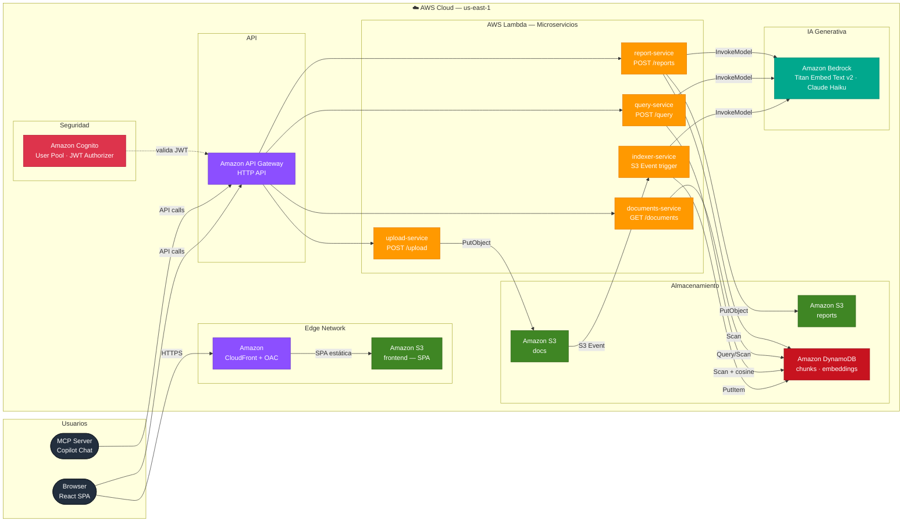

# Arquitectura — SemanticSearch RAG

Sistema de búsqueda semántica sobre documentos propios. El usuario sube PDFs/Word,
el sistema los chunkea, genera embeddings y los indexa; las preguntas en lenguaje
natural se responden citando fuentes exactas de los documentos.

**Stack:** C# / .NET 8 · AWS Lambda · API Gateway (HTTP API) · DynamoDB ·
Amazon Bedrock · S3 · Amazon Cognito · CloudFront · Terraform · GitHub Actions (OIDC) · React (Vite + TS)

---

## Diagrama general



---

## Pipelines

### Pipeline A — Ingesta de documentos

```
Cliente ──POST /upload──► API Gateway ──► Lambda (upload-service)
                                                    │
                                                    ▼
                                           S3 (bucket docs)
                                                    │
                                       S3 Event Notification
                                                    ▼
                                       Lambda (indexer-service)
                                                    │
                          ┌─────────────────────────┤
                          ▼                         ▼
                   Amazon Bedrock              DynamoDB
                   (Titan Embed v2)        (tabla "chunks")
```

1. El cliente hace `POST /upload` con el archivo (PDF / DOCX / TXT)
2. `upload-service` valida tamaño y tipo, sube el objeto al bucket S3 `docs`
3. S3 dispara un evento `s3:ObjectCreated:*` que invoca `indexer-service`
4. `indexer-service` extrae el texto, lo divide en chunks con sliding window (512 palabras, overlap 64), llama a Bedrock para generar el embedding de cada chunk, y escribe los `ChunkRecord` en DynamoDB
5. Si falla, el objeto se mueve al prefijo `failed/` en S3 (en vez de DLQ gestionada, para mantenerse en Always Free)

### Pipeline B — Query RAG

```
Cliente ──POST /query──► API Gateway ──► Lambda (query-service)
                                                    │
                                           embed query text
                                                    ▼
                                             Amazon Bedrock
                                             (Titan Embed v2)
                                                    │
                                     similitud coseno en memoria
                                                    ▼
                                               DynamoDB
                                             (top-K chunks)
                                                    │
                                           build RAG prompt
                                                    ▼
                                             Amazon Bedrock
                                             (Claude Haiku)
                                                    │
Cliente ◄── { answer, sources } ───────────────────┘
```

1. El cliente envía la pregunta en lenguaje natural
2. `query-service` genera el embedding de la pregunta con Titan Embed v2
3. Lee todos los chunks de DynamoDB y calcula similitud coseno en memoria, retorna top-K
4. Arma un prompt RAG con los fragmentos más relevantes y llama a Claude Haiku
5. Devuelve la respuesta con fuentes citadas (`documentId`, `filename`, `page`, `score`)

### Pipeline C — Generación de informes

```
Cliente ──POST /reports──► API Gateway ──► Lambda (report-service)
                                                    │
                                        lee corpus completo
                                                    ▼
                                               DynamoDB
                                                    │
                                         genera con Bedrock
                                                    ▼
                                             Amazon Bedrock
                                             (Claude Haiku)
                                                    │
                                           guarda el informe
                                                    ▼
                                           S3 (bucket reports)
                                                    │
Cliente ◄── { reportId, downloadUrl } ─────────────┘
```

El informe se genera según un escenario predefinido (`summary`, `risks`, `compare`,
`extract`, `custom`) y queda disponible en S3 con URL prefirmada durante 7 días.

---

## Servicios AWS y decisiones de diseño

### Cuenta AWS y costos

La cuenta es **nueva (2026)**, por lo que aplica el esquema actual de Free Tier:
$100-200 de crédito durante 6 meses y un set de servicios **Always Free** permanentes:
Lambda, DynamoDB, Cognito, CloudWatch, Step Functions, CloudFront.

El diseño se apoya deliberadamente en esos servicios para que el costo de
infraestructura sea **$0 de forma permanente**. El único costo real es Amazon Bedrock
(sin free tier, pay-per-token), que cuesta centavos en el volumen de un proyecto
académico. Hay un AWS Budget Alert configurado para evitar gastos accidentales.

### Por qué DynamoDB y no un vector store gestionado

| Opción | Problema |
|---|---|
| OpenSearch Service / Serverless | Sin free tier real; puede costar $700+/mes por los OCUs mínimos |
| RDS + pgvector | Free tier solo 12 meses; instancia siempre prendida — rompe el modelo serverless |
| **DynamoDB** | Always Free (25 GB); chunks + embeddings en items; similitud coseno calculada en código dentro del Lambda |

Para un corpus académico (decenas/cientos de documentos), un `Scan` + similitud
coseno en memoria es rápido y simple. No es la elección correcta para millones de
chunks en producción.

### Por qué Lambdas separados por responsabilidad

En vez de un monolito Lambda con ASP.NET Core sirviendo todos los endpoints, cada
operación es su propia función: `upload`, `indexer`, `query`, `documents`, `reports`.
Esto cumple el requisito de "microservicios" de la materia: cada función escala,
se despliega y se factura de forma independiente, con un único motivo para cambiar.

### Por qué .NET 8 y no .NET 10

.NET 8 es el runtime managed más reciente que AWS Lambda soporta nativamente. Si se
necesitan features de .NET 10, la alternativa es empaquetar la Lambda como imagen de
contenedor, pero se prioriza el runtime nativo (cold start más rápido, menos
complejidad).

---

## DynamoDB — diseño de la tabla `chunks`

| Atributo | Tipo | Rol |
|---|---|---|
| `documentId` | String | Partition Key |
| `chunkId` | String | Sort Key |
| `text` | String | texto del chunk |
| `embedding` | List\<Number\> | vector de embedding (Titan Embed v2 = 1024 dims) |
| `filename` | String | nombre original del documento |
| `page` | Number | página de origen (si aplica) |
| `status` | String | `indexed` / `failed` |
| `createdAt` | String (ISO 8601) | fecha de indexado |

La tabla `documents` (metadata) guarda el registro por documento: `documentId`,
`filename`, `status`, `chunkCount`, `uploadedAt`. Se implementa como ítems con
`chunkId = "META"` dentro de la misma tabla o en una tabla separada.

---

## Endpoints de la API

| Método | Path | Auth | Lambda | Descripción |
|---|---|---|---|---|
| POST | `/upload` | JWT (Cognito) | `upload-service` | Sube documento a S3, dispara indexación |
| POST | `/query` | JWT (Cognito) | `query-service` | Búsqueda semántica RAG |
| GET | `/documents` | JWT (Cognito) | `documents-service` | Lista documentos con estado y metadata |
| POST | `/reindex/{docId}` | JWT (Cognito) | `documents-service` | Fuerza re-indexación de un documento |
| DELETE | `/documents/{docId}` | JWT (Cognito) | `documents-service` | Elimina documento y sus chunks |
| GET | `/health` | ninguna | `documents-service` | Health check (excluido del JWT Authorizer) |
| POST | `/reports` | JWT (Cognito) | `report-service` | Inicia generación de informe |
| GET | `/reports/{reportId}` | JWT (Cognito) | `report-service` | Descarga el informe generado |

---

## Infraestructura como código (Terraform)

> IaC migrado de Bicep (Azure) y AWS SAM a **Terraform**. Los archivos `*.bicep`
> y `infra/template.yaml` quedan como referencia histórica.

```
infra/
├── main.tf          # recursos principales (Lambdas, API GW, S3, DynamoDB, Cognito)
├── variables.tf     # variables de entorno y región
├── outputs.tf       # URL de API Gateway, distribución CloudFront, ARNs
├── backend.tf       # backend remoto S3 + locking DynamoDB para el estado
└── terraform.tfvars.example  # plantilla (el .tfvars real no se commitea)
```

Comandos de despliegue:

```bash
terraform init
terraform plan -out=tfplan
terraform apply tfplan
```

Permisos IAM mínimos por Lambda (least privilege — ninguna función tiene `*` en
resources). La distribución CloudFront usa Origin Access Control (OAC) para servir
el bucket frontend sin exponerlo públicamente.

---

## CI/CD — GitHub Actions (OIDC)

```
.github/workflows/
├── deploy.yml           # build · test · terraform apply (backend + Lambdas)
└── deploy-frontend.yml  # npm build · sync S3 · invalidación CloudFront
```

El rol IAM `AWS_DEPLOY_ROLE_ARN` se configura con confianza hacia el OIDC provider
de GitHub Actions — nunca se guardan access keys de AWS en GitHub Secrets.

```yaml
- name: Configure AWS credentials (OIDC)
  uses: aws-actions/configure-aws-credentials@v4
  with:
    role-to-assume: ${{ vars.AWS_DEPLOY_ROLE_ARN }}
    aws-region: us-east-1
```

---

## Frontend — React SPA (Vite + TypeScript)

```
frontend/
├── src/
│   ├── api/client.ts         # fetch wrapper con URL de API Gateway + JWT
│   ├── pages/
│   │   ├── UploadPage.tsx    # drag & drop → upload-service
│   │   ├── DocumentsPage.tsx # lista + estado de indexado → documents-service
│   │   ├── QueryPage.tsx     # chat de preguntas → query-service, muestra fuentes
│   │   └── ReportsPage.tsx   # selector de escenario → report-service
│   └── App.tsx
└── vite.config.ts
```

Build de producción (`npm run build`) → sync del directorio `dist/` al bucket S3
`frontend` (privado) → invalidación de la distribución CloudFront que sirve la SPA
con OAC.

---

## Servidor MCP — agente @doc-search

Expone tres herramientas a Copilot Chat sin cambios en el código; solo cambia la URL
del entorno a la URL de API Gateway en AWS.

```json
// .vscode/settings.json
{
  "github.copilot.chat.mcpServers": {
    "doc-search": {
      "command": "dotnet",
      "args": ["run", "--project", "src/SemanticSearch.McpServer"],
      "env": {
        "API_URL": "https://xxxxxxxxxx.execute-api.us-east-1.amazonaws.com"
      }
    }
  }
}
```

| Herramienta | Descripción |
|---|---|
| `search_documents` | Búsqueda semántica RAG sobre el corpus |
| `list_documents` | Lista documentos indexados y su estado |
| `reindex_document` | Fuerza la re-indexación de un documento por ID |

---

Ver [`TODO.md`](../TODO.md) para el estado de implementación por fases y
[`docs/blueprint-csharp.md`](blueprint-csharp.md) para el código de referencia
de cada servicio.
